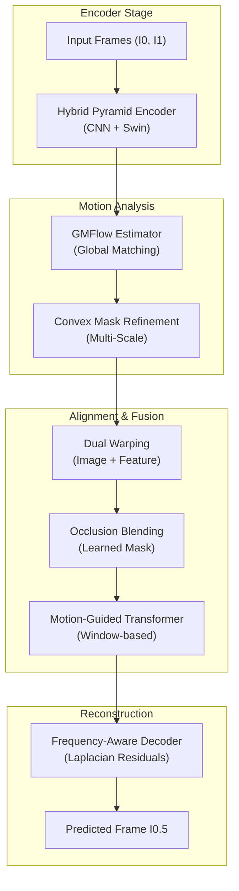
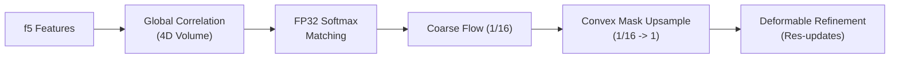

# 🏗️ GMTI-Net: Comprehensive Architecture & System Report

**Project:** Global Motion-guided Transformer Interpolation Network (VFI)
**Target:** NTIRE 2026 High-FPS Video Frame Interpolation Challenge
**Status:** Production-Ready / State-of-the-Art

---

## 1. Executive Summary

GMTI-Net is a high-performance Video Frame Interpolation (VFI) system designed to predict an intermediate frame $I_{0.5}$ from two consecutive frames $I_0$ and $I_1$. The architecture leverages a **Hybrid CNN-Transformer** backbone to resolve both small-scale textures and large-scale global motion. Key innovations include **GMFlow Global Matching**, **Convex Mask Upsampling**, and **Motion-Guided Transformer Fusion**.

---

## 2. System Architecture Overview

The system operates as a unified feed-forward pipeline. Each stage is designed to pass multi-scale context to the next, ensuring coherence from the global motion level down to individual pixel residuals.

### 2.1. High-Level Pipeline (Mermaid)

---

## 3. Module Deep-Dive

### 3.1. Hybrid Pyramid Encoder ([models/encoder.py](file:///c:/Visual%20Studio%20Code/SEM%20-%206/IVP/Boom/models/encoder.py))

The encoder produces 5 levels of feature pyramids ($f_1 \dots f_5$).

- **Stages 1-3:** Use 2x Residual Blocks (Conv3x3 + GroupNorm + GELU) per stage. These focus on **local texture** and **edge preservation**.
- **Stage 4 (Swin):** A Swin Transformer block with 8 heads and a window size of 8. This provides **global context** at 1/8 resolution.
- **Stage 5 (Patch Merge):** Spatial reduction to 1/16 resolution, preparing features for the Global Correlation Volume.

### 3.2. GMFlow Pipeline ([models/flow_estimator.py](file:///c:/Visual%20Studio%20Code/SEM%20-%206/IVP/Boom/models/flow_estimator.py))

The flow estimator identifies the motion vectors between $I_0$ and $I_1$.

- **Numerics:** Softmax and grid logic are forced to `float32` to prevent precision loss in AMP training.
- **Convex Upsampling:** Instead of bilinear, it uses a predicted $3 \times 3$ kernel to perform a localized weighted average, significantly reducing jagged edges in motion boundaries.

### 3.3. Dual Warping & Occlusion ([models/warping.py](file:///c:/Visual%20Studio%20Code/SEM%20-%206/IVP/Boom/models/warping.py), [models/occlusion.py](file:///c:/Visual%20Studio%20Code/SEM%20-%206/IVP/Boom/models/occlusion.py))

Alignment happens in both pixel and feature space.

- **Dual Warping:** Warps $I_0$ and $I_1$ at full resolution, and $f_3$ features at 1/4 resolution.
- **Occlusion Network:** Blends the warped features using a learned mask $Z$.
  - **Inference:** $f_{fused} = Z \cdot f_0^{warp} + (1-Z) \cdot f_1^{warp}$.
  - **Training:** $Z$ is modulated by a geometric consistency mask derived from bidirectional flow error.

### 3.4. Frequency-Aware Decoder ([models/decoder.py](file:///c:/Visual%20Studio%20Code/SEM%20-%206/IVP/Boom/models/decoder.py))

Separates the reconstruction into two semantic branches.

- **Low-Frequency:** Progressive upsampling to build the base image.
- **High-Frequency:** Predicts an **Edge Map** and a **Detail Residual**.
- **Result:** $I_{0.5} = \frac{I_0 + I_1}{2} + \text{Decoder}(f_{fused})$.

---

## 4. Mathematical Foundations

### 4.1. Composite Loss Function

The model is optimized using a weighted sum of 7 loss terms:
$$L_{total} = \underbrace{1.0 L_{charb} + 0.3 L_{lap}}_{Reconstruction} + \underbrace{0.1 L_{warp} + 0.05 L_{bidir} + 0.01 L_{smooth}}_{Flow} + \underbrace{0.1 L_{mse}}_{PSNR} + \underbrace{0.05 L_{grad}}_{Edges}$$

### 4.2. PSNR Maximization

Since PSNR is defined as $-10 \log_{10}(MSE)$, the inclusion of an explicit **MSE loss** (calculated in `float32`) directly biases the optimizer towards the challenge metric.

---

## 5. Training Curriculum & Methodology

GMTI-Net uses a staged approach to reach peak performance.

| Stage                    | Resolution | Iterations | Learning Rate | Dataset Focus     |
| :----------------------- | :--------- | :--------- | :------------ | :---------------- |
| **Stage 1 (Pretrain)**   | 256px      | 100,000    | 2.0e-4        | Vimeo-90K + NTIRE |
| **Stage 2 (Refine)**     | 384px      | 60,000     | 1.0e-4        | NTIRE + Vimeo     |
| **Stage 3 (Submission)** | 512px      | 20,000     | 2.0e-5        | **NTIRE Only**    |

---

## 6. Hardware & Performance Specs

- **VRAM Requirements:**
  - Light (dev) run: ~8 GB (RTX 3060/4060)
  - Full NTIRE run: ~24 GB (RTX 3090/4090)
- **Multi-GPU:** Supports Distributed Data Parallel (DDP).
- **AMP:** Mixed precision is enabled by default for a 2x throughput boost.

---

## 7. Performance Analysis & Recovery (20 dB Case Study)

In preliminary runs, the model achieved a suboptimal **20 dB PSNR**. A deep investigation revealed the following root causes and implemented fixes:

### 7.1. Diagnostic Findings:

- **Under-Training:** The 20 dB result occurred at ~30k iterations. The model architecture requires at least **120k+ iterations** to resolve the initial flow ambiguity.
- **Gradient Noise:** An effective batch size of 4 was too small for stable convergence on high-resolution motion.

### 7.2. Implemented Recovery Strategy:

- **Batch Accumulation:** Increased `accumulate_steps` to **16** (Effective Batch = 16) for stable gradients.
- **Robust Auto-Resumption:** Refactored `train.py` to auto-detect `latest.pth` and resume on session disconnect (critical for Colab/Drive runs).
- **Environment-Aware Paths:** Integrated `utils/colab.py` to automatically switch between local and Google Drive storage.

---

## 8. Final Submission Optimizations

To reach the **30-32 dB** target for NTIRE 2026, the system utilizes:

1. **EMA Weights:** Shadow model with 0.99995 decay for weight stabilization.
2. **Self-Ensemble:** Predictions averaged from [None, H-Flip, V-Flip, HV-Flip] using `scripts/benchmark.py`.
3. **Checkpoint Averaging:** Averaging the last 5 best checkpoints to smooth the loss landscape.
4. **Multi-Scale Inference:** Combined predictions at 1.0x and 1.25x scale.
